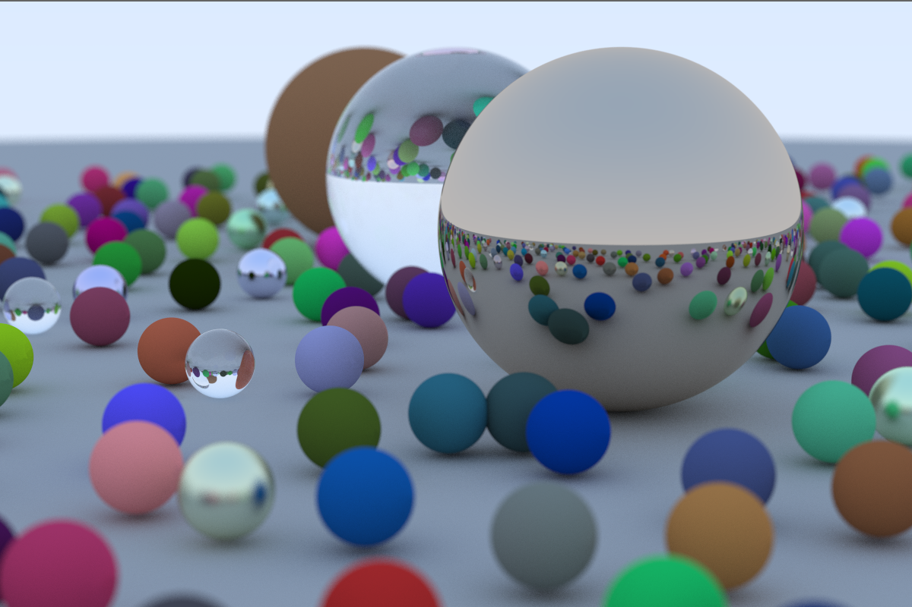

# rustracer
An implementation of a ray tracer in Rust [[credit to  the great book series by Peter Shirley](https://raytracing.github.io/)].

Still a work in progress, but in the meanwhile, here's a pic I've rendered so far-

